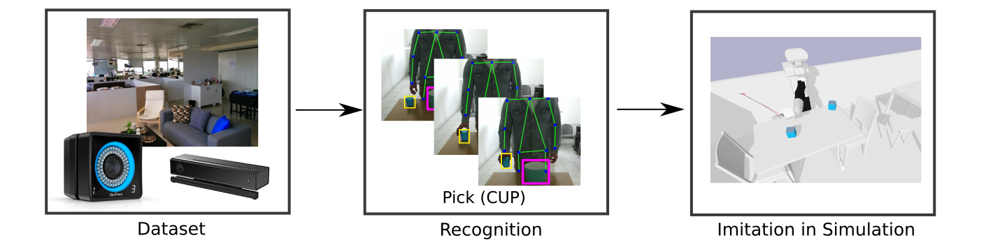

# Simitate: A Hybrid Imitation Learning Benchmark



* A preprint can be found on [arxiv](https://arxiv.org/abs/1905.06002).
* A short overview video is available on [youtube](https://www.youtube.com/watch?v=EHRgX0_G-j4)
* A [pytorch dataset integration](https://github.com/airglow/simitate_dataset_pytorch) is available


<!--<section id="video" class="bg-light">-->
## Video
<video width=100% controls>
<source src="video/simitate.mp4">
</video>

[](https://www.youtube.com/watch?v=EHRgX0_G-j4)

In case the video does not play you can download it [here](https://agas.uni-koblenz.de/simitate/web/video/simitate.mp4)

# Dataset

The root of the data folder can be found here: [All Files](https://agas.uni-koblenz.de/data/simitate/data/simitate/)

The dataset (ca. 423 GB) is available here: [Simitate Data](https://agas.uni-koblenz.de/data/simitate/data/simitate/data/).
We provide ROS bag file and jpg sequences of RGB and depth camera separately. Timestamps
are encoded in the filename. The accompanied CSV files, per sequence, contains ground truth
poses for the demonstrator's hand and the objects of interest.

To batch download the files you can use the following command:

This will download e.g. all basic motions sequences:

```
wget -m --no-parent --reject index.html* https://agas.uni-koblenz.de/data/simitate/data/simitate/new_extracted/basic_motions

```

## Overview

A tabular scene overview to download individual sequences can be found here:

* [Basic Motions](https://agas.uni-koblenz.de/simitate/web/table_basic_motions.html)
* [Motions](https://agas.uni-koblenz.de/simitate/web/table_motions.html)
* [Sequential](https://agas.uni-koblenz.de/simitate/web/table_sequential.html)
* [Complex](https://agas.uni-koblenz.de/simitate/web/table_complex.html)


<!--Exemplary trajectories for pick and place can be found [here](./data/pick_and_place.tar.gz)-->
<!--Exemplary trajectories for basic motions can be found [here](./data/basic_motions.zip)-->
<!--Further data be available for download here on paper acceptance. Currently sequences are-->

<!--* RGB and depth images-->
<!--* ground truth in csv format with timestamps and poses for the demonstrators hand and objects-->
<!--* Bag files containing Ground Truth, RGB and Depth streams-->
<!--* Pre-trained models for YOLO and MaskRCNN-->

## Benchmark

For benchmarking you need to execute the following steps:

For trajectory quality:

* Pick a sequence
* We provide a `trajectory_loader` class that supports you on collecting your estimates for later evaluation
* Imitate the visually observed behaviour 

```python

import trajectory_loader

tl = trajectory_loader.SimitateTrajectoryLoader()
tl.load_trajectories(trajectory_file)

# add estimates
tl.add_point_to_trajectory("estimated_position"+robot_name, <timestamp>, <pos/pose>)

# after imitation add save the file for getting evaluation results
tl.save_trajectory_to_file(os.path.basename(trajectory_file+".pkl")

```

The trajectory loader and the evaluation scripts can be found [here](https://agas.uni-koblenz.de/data/simitate/data/simitate/code/)

Then use the `eval_ate.py` script like:

```
python2.7 eval_ate.py <ground_truth_file>.csv <estimated>.pkl
```

Afterwards you get the corresponding metric result. We provide exemplary estimates
from the paper. You can find the files in `<simitate>/data/eval/`

<!--The benchmark integration in simulation will be available here. -->


We provide integration into:

* PyBullet (focused)
* Gazebo (minimal)

Simitate is available as a ROS package here:

[Simitate Package](https://agas.uni-koblenz.de/data/simitate/data/simitate/code/)


## PyBullet

<!--We focus on support for PyBullet in favor over Mujoco, because of it's free -->
<!--availability.-->
PyBullet is mainly supported by Simitate. The Simitate Environment for PyBullet 
can be found here: [PyBullet Env](https://agas.uni-koblenz.de/data/simitate/data/simitate/code/pybullet-env.tar.bz2).
Tests were executed in Ubuntu 16.04 and Ubuntu 18.04.

* Python 2
* `pip install PyBullet`

then run using to show the ground truth e.g. with the Sawyer robot:

`python2.7 simitate_bullet.py -r 1 -gt examples/zickzack_2018-08-23-18-04-27.csv`

This command should run the simulation of a zickzack trajectory.

The script looks for estimated trajectories for evaluation, in case none are found 
the simulated robot executes the ground-truth trajectory.

Further Information:
```
usage: simitate_bullet.py [-h] [-gt] [-r R] csvfile

positional arguments:
  csvfile

optional arguments:
  -h, --help  show this help message and exit
  -gt         use ground truth
  -r R        choose robot. R=0 is tiago, R=1 is sawye
```

The result using the TIAGo robot and the ground-truth should be like this:


And the estimated trajectory using the presented baseline approach:


## Gazebo


### Perquisites 

* ROS Kinetic
* Gazebo 7 
* Tested in Ubuntu 16.04


<!--#### Mujoco-->

<!--* Mujoco -->
<!--* mujoco_py-->

<!--### Installation-->

<!--Depending on the robot you want to use for execution. -->

<!--### Sequences-->

<!--To download the sequences, we provide a script-->

<!--`./download_sequences.sh`-->

<!--These sequences contain bag files (for ROS and Gazebo) but also contain dumps-->
<!--usable by Mujoco.-->


#### TIAGo

We made experiments with PAL Robotics TIAGo robot in simulation and followed the
install instructions found [here](http://wiki.ros.org/Robots/TIAGo/Tutorials/Installation/TiagoSimulation)

#### PR2

`sudo apt install ros-kinetic-pr2-gazebo`


#### Launch

To launch the Gazebo simulator using the Simitate benchmark execute the following steps:

```
# edit the config/spawn_from_ground_truth.yaml and add the frames of interest
roslaunch simitate gazebo.launch robot:=pr2|tiago
rosbag play <sequence_path>/<sequence_name>.bag

```


<!--### Mujoco-->

<!--`python3.6 mj_simitate.py <sequence_file>`-->

<!--## Evaluation-->

## Contributing

This section is meant in case you want to extend the dataset with new sequences.
We highly encourage to new additions. This can be:

* Existing classes in new environments
* Introducing new tasks
* New robot models

### Recording new sequences

We did our best to provide a framework for extending. Scripts for recording are
in the repository.

#### Prerequisites

* `sudo apt install ros-kinetic-vrpn-client-ros ros-kinetic-vrpn`

#### Steps

For recording you need to execute the following steps:

* Make sure that you are connected to Ethernet
* Make sure that the Motive host is connected to Ethernet
* Make sure that you can reach the machine running Motive (`ping 192.168.0.2`)
* Make sure that you enable the VRPN Streaming Engine (View -> Data Streaming Pane -> VRPN Streaming Engine -> Broadcast VRPN Data: <On>)
* `roslaunch simitate record_motion.launch` will connect to Motive an visualize the tracked markers.

### Playback

Example:

 `simitate play_motion.launch file:=basic_motions_raphael/take03/circle_2018-08-23-17-55-04.bag`

## Additional

### Camera Calibration

We provide the intrinsic and extrinsic calibration files used during the recording of 
the sequences. This allows the projection of motion capture data to the images.
The camera transformations are contained in the `.csv` files per sequence as the
motion capture system has been recalibrated throughout the recording of the sequences.
We recommend using the `get_transform_to_world` function from the `SimitateTrajectoryLoader` for reading the transformation.


```
height: 540 
width: 960 
distortion_model: "plumb_bob" 
D: [0.08358987550663602, -0.14957906731226864, -0.003103469710389675, -0.00031033751957969485, 0.06981523248780676] 
K: [536.005076997568, 0.0, 478.48108901107867, 0.0, 537.8178473127615, 254.99770751448608, 0.0, 0.0, 1.0] 
R: [1.0, 0.0, 0.0, 0.0, 1.0, 0.0, 0.0, 0.0, 1.0] 
P: [536.005076997568, 0.0, 478.48108901107867, 0.0, 0.0, 537.8178473127615, 254.99770751448608, 0.0, 0.0, 0.0, 1.0, 0.0]
```

Extrinsic calibration files are provided [here](data/simitate/camera_calibration.tar.bz2)

### Objects


For reproduction purposes we provide a list of objects used in the experiments.
The following objects from IKEA have been used for Simitate:

| Name         |  Number       |  Type                                   
|--------------| --------------| --------------------
| 365+         |  604.063.04   |  plates                                 
| JÄLL         |  202.428.90   |  ironing board                         
| BITTERMANDEL |  204.323.81   |  vase                                  
| STEKA        |  926.258.00   |  pan                                   
| PS 2002      |  303.879.72   |  watering can                          
| LILLNAGGENA  |  402.435.96   |  Shower squeegee
| FÖRDUBBLAA   |  903.459.41   |  2-piece knife set
| HEAT         |  870.777.00   |  trivet
| ANTAGENA     |  202.339.61   |  Dish brush
| BLASKA       |  701.703.29   |  Dust pan and brush
| GNARP        |  303.358.41   |  3-piece kitchen utensil set, black
| SVAMPIG      |  602.576.05   |  sponge
| FLUNDRA      |  401.769.59   |  dish drainer
| FÄRGRIK      |  003.189.56   |  mug
| VISPAD       |  602.575.25   |  colander
| GLIS         |  800.985.83   |  box with lid 
| FEJKA        |  903.751.55   |  Artificial potted plant 
| GUBBRÖRA     |  902.257.31   |  Rubber spatula

Table:  Object list for Simitate

### Citation

```
@article{memmesheimer2019simitate,
  title={Simitate: A Hybrid Imitation Learning Benchmark},
  author={Memmesheimer, Raphael and Mykhalchyshyna, Ivanna and Seib, Viktor and Paulus, Dietrich},
  journal={arXiv preprint arXiv:1905.06002},
  year={2019}
}
```
